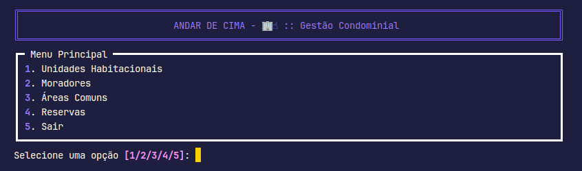

# [🏢☝️] Andar de Cima

Sistema para gestão de condomínios habitacionais.

**Andar de Cima** é uma solução abrangente e eficiente projetada para simplificar e otimizar todas as operações relacionadas à administração de condomínios habitacionais. Com uma interface intuitiva e recursos robustos, oferecemos uma plataforma centralizada para gerenciar todas as atividades, como o cadastro de moradores e gestão das áreas comuns, proporcionando transparência, eficiência e segurança.

## Funcionalidades

1. [Cadastro de **Unidades Habitacionais**](#cadastro-de-unidades-habitacionais):
    - [x] Inclui unidade habitacional;
    - [ ] Altera unidade habitacional;
    - [ ] Exclui unidade habitacional; e
    - [x] Listar unidades habitacionais.
1. [Cadastro de **Moradores**](#cadastro-de-moradores):
    - [ ] Inclui morador;
    - [ ] Altera morador;
    - [ ] Exclui morador; e
    - [ ] Listar moradores.
1. [Cadastro de **Áreas Comuns**](#cadastro-de-áreas-comuns):
    - [ ] Inclui área comum;
    - [ ] Altera área comun;
    - [ ] Exclui área comun; e
    - [ ] Listar área comuns.
1. [Gestão de **Reservas de Áreas Comuns**](#gestão-de-reservas-de-áreas-comuns):
    - [ ] Agendamento de área comum;
    - [ ] Reagendamento de área comum;
    - [ ] Cancelamento de agendamento; e
    - [ ] Listar agendamentos.

## Definições

As caracteristicas que são gerenciadas pelo sistema são as seguintes:

### Unidade Habitacional

    - ID: Número que identifica a unidade habtacional.
    - PROPRIETÁRIO: Nome do proprietário.
    - CONTATO: email do proprietário.
    - CARACTERISTICAS: Descrição da unidade habitacional.

### Morador Responsável

    - CPF: Documento identificador do morador.
        > Somento numeros com 11 posições.
    - NOME: Nome do morador.
    - CONTATO: email do morador.
        > Deve atender a definição de um email válido.
    - QTD CO-HABITANTES: Quantidade de pessoasl que moram com o responsável.
    - UNIDADE: ID da unidade habitacional.

### Área Comum

    - CODIGO: Identificador da área.
    - NOME: Nome da área.
    - DESCRIÇÃO: Caracteristicas da área.

### Agendamento

    - MORADOR RESPONSAVEL: CPF do morador responsável.
        > Deve apontar para um CPF já cadastrado em [Morador Responsável](#morador-responsável)
    - CODIGO ÁREA: Identificador da área.
        > Deve apontar para um código já cadastrado em [Área Comum](#área-comum)
    - DATA: Data da reserva.
        > Deve usar o formato "DD/MM/YYY"

## Especificações Funcionais (Stories)

### Cadastro de Unidades Habitacionais

Como  usuário do sistema desejo manter o cadastro das unidades habitacionais, para que possa manter um resgistro da estrutura do condomino que administro.

#### CENARIO 1 - Inclusão de unidade

> - **DADO QUE** o usuário acesse o menu de inserir unidade;
> - **QUANDO** ele entrar com os dados referentes a uma unidade que deseja incluir, seguindo as definições descritas em [Unidade Habitacional](#unidade-habitacional), corretamente;
> - **ENTÃO** o sistema guardará estas informações e informará ao usuário que o cadastro ocorreu com sucesso.

#### CENARIO 2 - Atualização de dados de uma unidade

> - **DADO QUE** o usuário acesso o meno de atualizar unidade;
> - **QUANDO** ele informa o ID da unidade a ser atualizada, o sistema valida se a unidade existe, e caso existe o sistema segue solicitando os demais dados da unidade([ver definição de unidade](#unidade-habitacional));
> - **ENTÃO** o sistema guradará as novas informações e informará ao usuário que a atualização ocorreu com sucesso.

#### CENARIO 3 - Exclusão de unidade

> - **DADO QUE** o usuário acesse o menu de excluir unidade;
> - **QUANDO** ele informa o ID da unidade a ser excluida, o sistema valida se a unidade existe, e caso exista o sistema solicita confirmação da exclusão;
> - **ENTÃO** o sistema excluirá a unidade e informará ao usuário que a exclusão ocorreu com sucesso.

#### CENARIO 4 - Listagem de unidades

> - **DADO QUE** o usuário acesse o menu de listar unidades;
> - **QUANDO** ele solicita a listagem;
> - **ENTÃO** o sistema apresentará a lista de todas as unidades cadastradas.

### Cadastro de Moradores

Como  usuário do sistema desejo manter o cadastro dos moradores, para que possa manter um resgistro dos moradores e seu relacionamento com as unidades habitacionais do condomino que administro.

#### CENARIO 1 - Inclusão de morador

> - **DADO QUE** o usuário acesse o menu de inserir morador;
> - **QUANDO** ele entrar com os dados referentes a um morador que deseja incluir, seguindo as definições descritas em [Morador Responsável](#morador-responsável), corretamente;
> - **ENTÃO** o sistema guardará estas informações e informará ao usuário que o cadastro ocorreu com sucesso.

#### CENARIO 2 - Atualização de dados de um morador

> - **DADO QUE** o usuário acesso o meno de atualizar morador;
> - **QUANDO** ele informa o CPF do morador a ser atualizado, o sistema valida se o morador existe, e caso existe o sistema segue solicitando os demais dados do morador([ver definição de morador](#morador-responsável));
> - **ENTÃO** o sistema guradará as novas informações e informará ao usuário que a atualização ocorreu com sucesso.

#### CENARIO 3 - Exclusão de morador

> - **DADO QUE** o usuário acesse o menu de excluir morador;
> - **QUANDO** ele informa o CPF do morador a ser excluido, o sistema valida se o morador existe, e caso exista o sistema solicita confirmação da exclusão;
> - **ENTÃO** o sistema excluirá o morador e informará ao usuário que a exclusão ocorreu com sucesso.

#### CENARIO 4 - Listagem de moradores

> - **DADO QUE** o usuário acesse o menu de listar moradores;
> - **QUANDO** ele solicita a listagem;
> - **ENTÃO** o sistema apresentará a lista de todos os moradores cadastrados.

### Cadastro de Áreas Comuns

Como  usuário do sistema desejo manter o cadastro das áreas comuns, para que possa manter um resgistro das áreas comuns do condomino que administro.

#### CENARIO 1 - Inclusão de área comum

> - **DADO QUE** o usuário acesse o menu de inserir área comum;
> - **QUANDO** ele entrar com os dados referentes a uma área comum que deseja incluir, seguindo as definições descritas em [Área Comum](#área-comum), corretamente;
> - **ENTÃO** o sistema guardará estas informações e informará ao usuário que o cadastro ocorreu com sucesso.

#### CENARIO 2 - Atualização de dados de uma área comum

> - **DADO QUE** o usuário acesso o meno de atualizar área comum;
> - **QUANDO** ele informa o código da área a ser atualizada, o sistema valida se a área existe, e caso existe o sistema segue solicitando os demais dados da área([ver definição de área comum](#área-comum));
> - **ENTÃO** o sistema guradará as novas informações e informará ao usuário que a atualização ocorreu com sucesso.

#### CENARIO 3 - Exclusão de área comum

> - **DADO QUE** o usuário acesse o menu de excluir área comum;
> - **QUANDO** ele informa o código da área a ser excluida, o sistema valida se a área existe, e caso exista o sistema solicita confirmação da exclusão;
> - **ENTÃO** o sistema excluirá a área e informará ao usuário que a exclusão ocorreu com sucesso.

#### CENARIO 4 - Listagem de áreas comuns

> - **DADO QUE** o usuário acesse o menu de listar áreas comuns;
> - **QUANDO** ele solicita a listagem;
> - **ENTÃO** o sistema apresentará a lista de todas as áreas cadastradas.

### Gestão de Reservas de Áreas Comuns

Como  usuário do sistema desejo manter um registro de reservas das áreas comuns, para que possa manter um controle das reservas e evitar conflitos de uso.

#### CENARIO 1 - Agendamento de área comum

> - **DADO QUE** o usuário acesse o menu de agendar área comum;
> - **QUANDO** ele informa o CPF do morador responsável, o código da área comum e a data da reserva, o sistema valida se os dados estão corretos e se a área está disponível;
> - **ENTÃO** o sistema guardará estas informações e informará ao usuário que o agendamento ocorreu com sucesso.

#### CENARIO 2 - Reagendamento de área comum

> - **DADO QUE** o usuário acesse o menu de reagendar área comum;
> - **QUANDO** ele informa o CPF do morador responsável, o código da área comum e a data da reserva, o sistema valida se os dados estão corretos e se a área está disponível;
> - **ENTÃO** o sistema guardará estas informações e informará ao usuário que o reagendamento ocorreu com sucesso.

#### CENARIO 3 - Cancelamento de agendamento

> - **DADO QUE** o usuário acesse o menu de cancelar agendamento;
> - **QUANDO** ele informa o CPF do morador responsável, o código da área comum e a data da reserva, o sistema valida se os dados estão corretos e se a reserva existe;
> - **ENTÃO** o sistema excluirá a reserva e informará ao usuário que o cancelamento ocorreu com sucesso.

#### CENARIO 4 - Listagem de reservas

> - **DADO QUE** o usuário acesse o menu de listar reservas;
> - **QUANDO** ele solicita a listagem;
> - **ENTÃO** o sistema apresentará a lista de todas as reservas cadastradas.

<!-- TEMPLATE DE STORE
> - **DADO QUE** xxx
> - **QUANDO** xxx
> - **ENTÃO** xxx 
-->